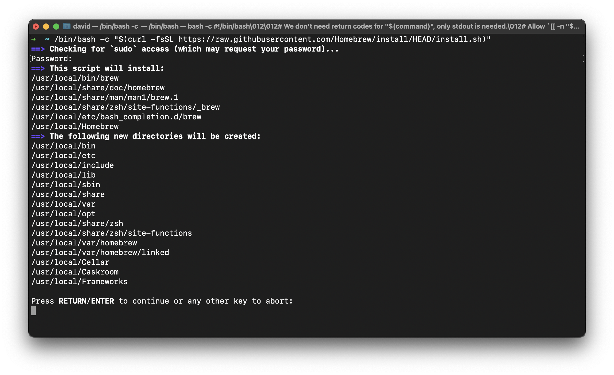
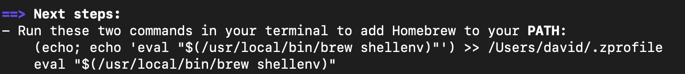
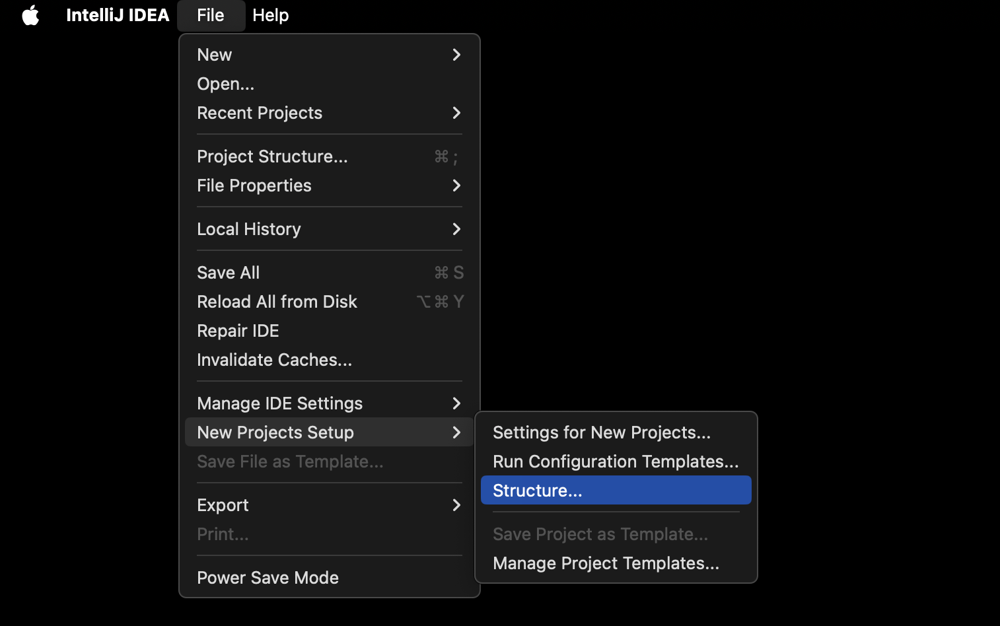
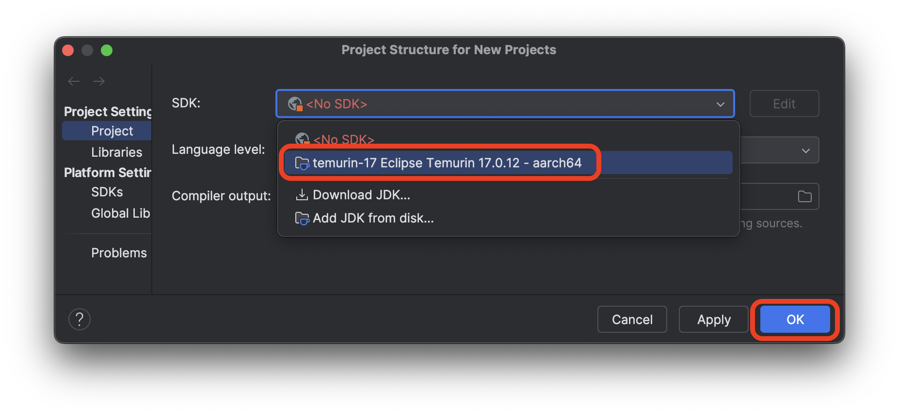

<h1>
  <span class="headline">Java Installfest</span>
  <span class="subhead">macOS</span>
</h1>

## What you need to begin *(you must read this, do not skip this, this is important)*

- ***A device running macOS 14 Sonoma or macOS 13 Ventura.***
- At least 10GB of free hard drive space.
- At least 8GB of RAM. 16GB of RAM or more is preferable and will improve your learning experience.
- A user account with administrative privilege to your local installation of macOS.
- A fundamental understanding of macOS system administration and debugging.

## What you'll install

By following this guide, you'll sign up for the following services:

- [GitHub Enterprise](#github-enterprise-ghe)

You'll install the following tools and software:

- [Homebrew](#homebrew)
- [Git](#git)
- [GitHub CLI](#github-cli)
- [JDK 17](#jdk-17)
- [IntelliJ CE](#intellij-idea-community-edition)

Finally, you'll [set up the directory structure used in the course](#set-up-the-directory-structure-used-in-the-course).

## Troubleshooting

If you run into issues during Installfest, please reach out to your Installfest point of contact.

## A note on copying commands

When possible, ***please copy the commands from this page***. You will use most of the commands here once and never again. Typing them out will only introduce the possibility of you making errors. Certain commands will require you to alter portions of them - this is specifically called out when they appear. There are no bonus points for doing work already done for you.

### Copying text in code blocks

To copy text from code blocks, use your mouse to hover over the code block. A **Copy** button will appear in the upper right corner. Click this, and the text held in the code block will be put on your clipboard, ready to be pasted.


## GitHub Enterprise (GHE)

You'll use General Assembly's private GitHub Enterprise instance (commonly abbreviated as GHE) throughout the course. If you think of GitHub as a social media platform for developers worldwide, you can think of GitHub Enterprise as a social media platform just for developers at General Assembly.

You can sign up for an account here: **[http://git-invite.generalassemb.ly/](http://git-invite.generalassemb.ly/)**

If you already have a GitHub account, you may use the same username for both GitHub & GHE accounts; however, we recommend that you distinguish between the two by appending **-ga** to your GitHub username, for example, **YourGitHubUsername-ga**.

## Homebrew

Homebrew is a package manager we will use to install various command-line tools in our class. Learn more [**here**](https://brew.sh).

In your terminal application, run this command:

```bash
/bin/bash -c "$(curl -fsSL https://raw.githubusercontent.com/Homebrew/install/HEAD/install.sh)"
```

You will be prompted to enter the user password for your device. Do so. It will not be displayed on the screen in any form as you type it - this is common for command-line password entry. After entering it, you will be prompted to allow the script to install various applications and create multiple directories, as shown in the screenshot below. Press <kbd>↩ Return</kbd> to allow this.

If you are prompted to install any Xcode tools, say yes.

Note that if you have a Mac with an Apple Silicon chip, your directory names may differ from those in this screenshot (likely starting with <code class="filepath">/opt/homebrew</code>). That's just fine!



### Next Steps *very important - you're not done yet!*


After completing the installation, you will likely be prompted to enter further commands found in the **Next steps** section in your terminal to finalize the installation. ***You must complete the actions in this prompt before proceeding.***

In the above output, we are told to **Run these two commands in your terminal to add Homebrew to your PATH:**



If you have a similar message, you ***must*** run the commands displayed in your terminal (feel free to copy and paste them!). <span class="warning">Do not enter the commands shown above. They will not work. You must copy the commands listed in your own terminal and run them.</span>

If no commands are shown under the **Next steps** section, you may continue.

## Git

Git is the version control software we will use in this course.

In your terminal application, run this command:

```bash
brew install git
```

### Git config

With Git installed, we can now make some configuration changes to make it a more effective tool. Complete all of the following configuration steps in your terminal.

Use the below command to add a user name to Git, which will be used to identify your commits. Replace `User Name` with a name of your choice. Make sure you leave the quotes surrounding your username. Keep the name somewhat professional, or just use your name - this will be used to identify your commits on GitHub. There will not be any output from this command.

```bash
git config --global user.name "User Name"
```

Next, use the below command to add an email to Git, which will be used to identify your commits.

Replace `user@email.com` with the email address associated with your [`https://git.generalassemb.ly`](https://git.generalassemb.ly) account. Ensure you leave the quotes surrounding your email. There will not be any output from this command.

```bash
git config --global user.email "user@email.com"
```

Set the default branch name to `main` with the below command. This will align the default branch name in Git with the default branch name on GitHub. There will be no output from this command.

```bash
git config --global init.defaultBranch main
```

Configure Git to track case changes in file names. There will not be any output from this command.

```bash
git config --global core.ignorecase false
```

## GitHub CLI

We'll use the GitHub command line utility to perform some actions on GitHub. Install it with this command in your terminal:

```bash
brew install gh
```

Once it is installed, you'll use it to log in to your General Assembly GitHub Enterprise account from the command line. Use this command:

```bash
gh auth login
```

You'll encounter a series of prompts to complete your login. Follow these steps:

1. You will be prompted to log in to a GitHub.com account or a GitHub Enterprise account. Select the **GitHub Enterprise Server** option.
2. Use `git.generalassemb.ly` as the GHE hostname.
3. Choose **HTTPS** as the preferred protocol for Git operations.
4. When asked to authenticate Git with your GitHub credentials, press <kbd>Y</kbd> and then <kbd>↩ Return</kbd>.
5. Select the **Login with a web browser** option when asked how you would like to authenticate.
6. Copy the one-time code from your terminal, then press the <kbd>↩ Return</kbd> key to open `https://git.generalassemb.ly/login/device` in your browser.
7. Paste the code you copied from the terminal, and hit continue.
8. Authorize the GitHub CLI when asked.
9. You may be asked to confirm your GHE account password. Do so.
10. The CLI app should update automatically to confirm that you're logged in. It should look something like this:

    ```plaintext
    ✓ Authentication complete.
    - gh config set -h git.generalassemb.ly git_protocol https
    ✓ Configured git protocol
    ✓ Logged in as student
    ```

You should now be able to interact with General Assembly's GitHub Enterprise from the command line!

## JDK 17

We'll get JDK 17 LTS from Adoptium. This will allow you to run and compile Java applications on your device.

If your computer has an Apple Silicon chip, download JDK 17 from [the download page](https://adoptium.net/temurin/releases/?os=mac&version=17&arch=aarch64&package=jdk). Download the `.pkg` file, not the `.tar.gz` file.

If your computer has an Intel chip, download JDK 17 from [the download page](https://adoptium.net/temurin/releases/?os=mac&version=17&arch=x64&package=jdk). Download the `.pkg` file, not the `.tar.gz` file.

Execute the downloaded file and follow the instructions to install it. There is nothing to customize.

### Configure the `JAVA_HOME` environment variable

After completing the installation, you'll set the `JAVA_HOME` environment variable on your system. This will assist applications that need access to the JDK to run.

The following instructions apply to the default shell for modern versions of macOS: zsh.

<blockquote class="warning">
  🚨 If you're using a different shell, you must modify the below commands (namely, change <code>.zshrc</code> to the file that holds your shell's configuration) to work on your system.
</blockquote>

> 🧠 Are you not sure which shell you're using? Run this command in your terminal:
>
> ```bash
> echo $0
> ```
>
> The output from this command will contain the shell name - for example, if you're using zsh, the output will be `-zsh`.

Run this command in your terminal to set the `JAVA_HOME` environment variable in zsh:

```bash
echo 'export JAVA_HOME="$(/usr/libexec/java_home -v 17)"' >> ~/.zshrc
```

### Confirm the `JAVA_HOME` environment variable has been set

No matter what shell you're using, follow these instructions after you've set the `JAVA_HOME` environment variable.

After you've set the environment variable above, you'll need to quit the terminal application.

<blockquote class="warning">
  🚨 Quit your terminal application completely before continuing.
</blockquote>

Start your terminal application and run this command:

```bash
echo $JAVA_HOME
```

You should see some output that looks similar to this:

```plaintext
/Library/Java/JavaVirtualMachines/temurin-17.jdk/Contents/Home
```

## IntelliJ IDEA Community Edition

We'll use IntelliJ IDEA Community Edition as our Java IDE. Download the Community Edition from [the download page](https://www.jetbrains.com/idea/download/?section=mac). Ensure that you select the appropriate version depending on your processor (Apple Silicon vs. Intel).

<blockquote class="warning">
  🚨 The IntelliJ IDEA Ultimate and IntelliJ IDEA Community Edition downloads are on the same page. Ensure you download the free Community Edition version, not the paid Ultimate version.
</blockquote>

Execute the downloaded file and install it by clicking and dragging the IntelliJ IDEA CE icon to the Applications shortcut.

Open the **IntelliJ IDEA CE** application now. macOS will prompt you to confirm you'd like to open the application since you downloaded it from the internet. Select the **Open** option.

Follow the prompts in the user agreement terms and the data sharing dialogs. If you are asked if you'd like to import your settings from another IDE, skip that step.

Finally, you'll arrive at a page titled **Welcome to IntelliJ IDEA**. We won't start a new project now, but we will configure some default settings.

### Set the default project SDK

With the IntelliJ IDEA application selected, select the **File** option from the menu bar in the upper left corner of your screen. Find the **New Projects Setup** option and then select **Structure...**. This is shown in the screenshot below.



A dialog box will appear where you can change the default settings for new projects. Change the SDK to the **temurin-17** option. The full option may appear slightly different than the option outlined in red in the screenshot below. That's okay.

After you've selected the default SDK, select the **OK** button outlined in red below.



## Set up the directory structure used in the course

Finally, let's set up the directory structure you'll use in the course. In your terminal, run these commands:

```bash
mkdir ~/code
mkdir ~/code/ga
mkdir ~/code/ga/labs ~/code/ga/lectures ~/code/ga/projects ~/code/ga/sandbox
```

Note the four directories we're creating in the <code class="filepath">~/code/ga</code> directory:

- <code class="filepath">lecture</code>: for your work while following along with the lecture content.
- <code class="filepath">labs</code>: for the lab assignments you create.
- <code class="filepath">projects</code>: for any projects you build in the course.
- <code class="filepath">sandbox</code>: for any quick experimentation.

All lecture material will assume you have this base directory structure, but if you'd like, you may further divide these directories based on topic, day/week, or any other method you choose.

## You did it!

Great work completing Installfest! 🎉
