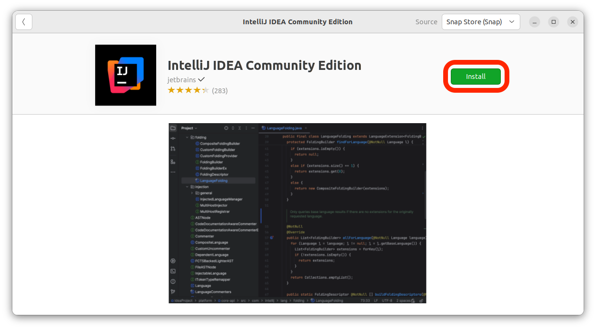
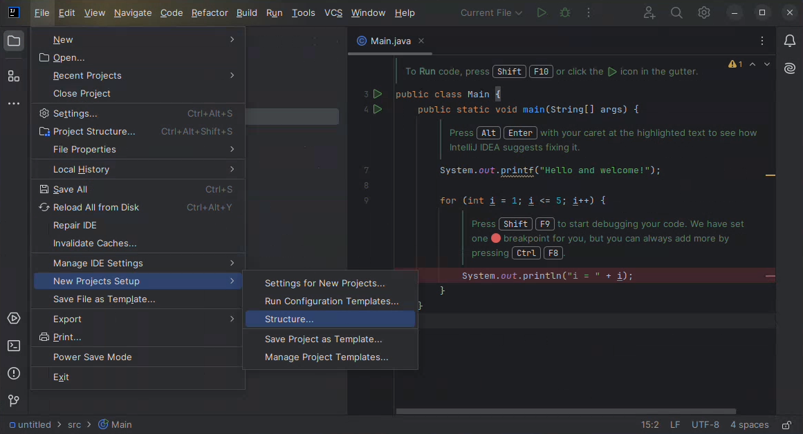
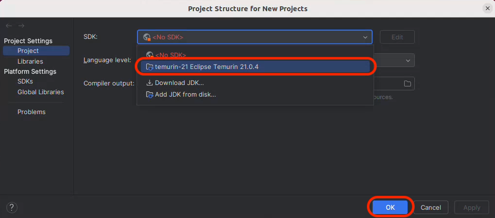

<h1>
  <span class="headline">Java Installfest</span>
  <span class="subhead">Ubuntu</span>
</h1>

## What you need to begin *(you must read this, do not skip this, this is important)*

- ***A device running Ubuntu 22.04 LTS (Jammy Jellyfish).*** Other versions of Ubuntu and flavors of Linux may be compatible with this Installfest, but they're not recommended.```
- At least 10GB of free hard drive space.
- At least 8GB of RAM. 16GB of RAM or more is preferable and will improve your learning experience.
- A user account with administrative privilege to your local installation of Ubuntu.
- A fundamental understanding of Linux system administration and debugging.

## What you'll install

By following this guide, you'll sign up for the following services:

- [GitHub Enterprise](#github-enterprise-ghe)

You'll install the following tools and software:

- [Git](#git)
- [GitHub CLI](#github-cli)
- [JDK 21](#jdk-21)
- [IntelliJ CE](#intellij-idea-community-edition)

## Troubleshooting

If you run into issues during Installfest, please reach out to your Installfest point of contact.

## A note on copying commands

When possible, ***please copy the commands from this page***. You will use most of the commands here once and never again. Typing them out will only introduce the possibility of you making errors. Certain commands will require you to alter portions of them - this is specifically called out when they appear. There are no bonus points for doing work already done for you.

### Copying text in code blocks

To copy text from code blocks, use your mouse to hover over the code block. A **Copy** button will appear in the upper right corner. Click this, and the text held in the code block will be put on your clipboard, ready to be pasted. By default, you'll need to use <kbd>Ctrl</kbd> + <kbd>Shift</kbd> + <kbd>V</kbd> to paste into the Ubuntu terminal.


## GitHub Enterprise (GHE)

You'll use General Assembly's private GitHub Enterprise instance (commonly abbreviated as GHE) throughout the course. If you think of GitHub as a social media platform for developers worldwide, you can think of GitHub Enterprise as a social media platform just for developers at General Assembly.

You can sign up for an account here: **[http://git-invite.generalassemb.ly/](http://git-invite.generalassemb.ly/)**

If you already have a GitHub account, you may use the same username for both GitHub & GHE accounts; however, we recommend that you distinguish between the two by appending **-ga** to your GitHub username, for example, **YourGitHubUsername-ga**.

## Updating and upgrading packages

Launch your terminal application now.

Your Linux installation will not automatically perform updates, but we'll want the latest versions of everything for the best experience. Run this command now to update your installed packages manually:

```bash
sudo apt update && sudo apt upgrade
```

You'll be prompted to provide your user password and accept the changes that need to be made. Do so. As you type your password in, you'll notice it doesn't appear in the terminal. This is normal for password entry; keep typing it in and hit <kbd>↩ Enter</kbd> when you're done.


Above, you can see a potential output of the command to update Ubuntu packages. Your output may be different from this, but that's okay!

## Git

Ensure you have access to the most recent stable version of Git with this command:

```bash
sudo add-apt-repository ppa:git-core/ppa
```

You may be prompted for your Ubuntu password. If you are, enter it. When prompted to continue, press <kbd>↩ Enter</kbd>. If you encounter an error during this process, check out the **Handling errors 💔** sub-section below.

Then run this command:

```bash
sudo apt-get update
```

and then finally, use this command to install Git on your machine:

```bash
sudo apt-get install git
```

Enter **`Y`** when prompted to continue.

### Handling errors 💔

After running the `sudo add-apt-repository ppa:git-core/ppa` command above, you may encounter an `HTTPError`. If you do, ensure that your system date and time are correct, then try the same command again. If this does not resolve your issue, reach out to your Installfest point of contact for assistance!

### Git config

With Git installed, we can now make some configuration changes to make it a more effective tool. Complete all of the following configuration steps in your terminal.

Use the below command to add a user name to Git, which will be used to identify your commits. Replace `User Name` with a name of your choice. Make sure you leave the quotes surrounding your username. Keep the name somewhat professional, or just use your name - this will be used to identify your commits on GitHub. There will not be any output from this command.

```bash
git config --global user.name "User Name"
```

Next, use the below command to add an email to Git, which will be used to identify your commits.

Replace `user@email.com` with the email address associated with your [`https://git.generalassemb.ly`](https://git.generalassemb.ly) account. Ensure you leave the quotes surrounding your email. There will not be any output from this command.

```bash
git config --global user.email "user@email.com"
```

Set the default branch name to `main` with the below command. This will align the default branch name in Git with the default branch name on GitHub. There will be no output from this command.

```bash
git config --global init.defaultBranch main
```

Configure Git to track case changes in file names. There will not be any output from this command.

```bash
git config --global core.ignorecase false
```

## GitHub CLI

We'll use the GitHub command line utility to perform some actions on GitHub. Install it with this command in your terminal:

```bash
(type -p wget >/dev/null || (sudo apt update && sudo apt-get install wget -y)) \
&& sudo mkdir -p -m 755 /etc/apt/keyrings \
&& wget -qO- https://cli.github.com/packages/githubcli-archive-keyring.gpg | sudo tee /etc/apt/keyrings/githubcli-archive-keyring.gpg > /dev/null \
&& sudo chmod go+r /etc/apt/keyrings/githubcli-archive-keyring.gpg \
&& echo "deb [arch=$(dpkg --print-architecture) signed-by=/etc/apt/keyrings/githubcli-archive-keyring.gpg] https://cli.github.com/packages stable main" | sudo tee /etc/apt/sources.list.d/github-cli.list > /dev/null \
&& sudo apt update \
&& sudo apt install gh -y
```

If you have errors, check out potential solutions to them in the **Handling errors 💔** sub-section below. Otherwise, skip to the **Authenticate with `gh`** sub-section.

### Handling errors 💔

If you get this error:

```plaintext
gpg: failed to start the dirmngr '/usr/bin/dirmngr': No such file or directory
```

Try installing the `dirmngr` package with this command:

```bash
sudo apt-get install dirmngr 
```

Then, repeat the installation steps above.

### Authenticate with `gh`

Once it is installed, you'll use it to log in to your General Assembly GitHub Enterprise account from the command line. Use this command:

```bash
gh auth login
```

You'll encounter a series of prompts to complete your login. Follow these steps:

1. You will be prompted to log in to a GitHub.com account or a GitHub Enterprise account. Select the **GitHub Enterprise Server** option.
2. Use `git.generalassemb.ly` as the GHE hostname.
3. Choose **HTTPS** as the preferred protocol for Git operations.
4. When asked to authenticate Git with your GitHub credentials, press <kbd>Y</kbd> and then <kbd>↩ Enter</kbd>.
5. Select the **Login with a web browser** option when asked how you would like to authenticate.
6. Copy the one-time code from your terminal, then press the <kbd>↩ Enter</kbd> key to open `https://git.generalassemb.ly/login/device` in your browser.
7. Paste the code you copied from the terminal, and hit continue.
8. Authorize the GitHub CLI when asked.
9. You may be asked to confirm your GHE account password. Do so.
10. The CLI app should update automatically to confirm that you're logged in. It should look something like this:

    ```plaintext
    ✓ Authentication complete.
    - gh config set -h git.generalassemb.ly git_protocol https
    ✓ Configured git protocol
    ✓ Logged in as student
    ```

You should now be able to interact with General Assembly's GitHub Enterprise from the command line!

## JDK 21

We'll get JDK 21 LTS from Adoptium. This will allow you to run and compile Java applications on your device. Install it with this command in your terminal:

```bash
sudo apt install -y wget apt-transport-https gpg \
&& wget -qO - https://packages.adoptium.net/artifactory/api/gpg/key/public | gpg --dearmor | sudo tee /etc/apt/trusted.gpg.d/adoptium.gpg > /dev/null \
&& echo "deb https://packages.adoptium.net/artifactory/deb $(awk -F= '/^VERSION_CODENAME/{print$2}' /etc/os-release) main" | sudo tee /etc/apt/sources.list.d/adoptium.list \
&& sudo apt update \
&& sudo apt install temurin-21-jdk
```

### Configure the `JAVA_HOME` environment variable

After completing the installation, you'll set the `JAVA_HOME` environment variable on your system. This will assist applications that need access to the JDK to run.

The following instructions apply to the default shell for modern versions of Ubuntu: bash.

<blockquote class="warning">
  🚨 If you're using a different shell, you must modify the below commands (namely, change <code>.bashrc</code> to the file that holds your shell's configuration) to work on your system.
</blockquote>

> 🧠 Are you not sure which shell you're using? Run this command in your terminal:
>
> ```bash
> echo $0
> ```
>
> The output from this command will contain the shell name - for example, if you're using zsh, the output will include `zsh`.

Run this command in your terminal to set the `JAVA_HOME` environment variable in bash:

```bash
echo 'export JAVA_HOME="$(readlink -f $(which javac) | sed '\''s:/bin/javac::'\'')"' >> ~/.bashrc
```

### Confirm the `JAVA_HOME` environment variable has been set

No matter what shell you're using, follow these instructions after you've set the `JAVA_HOME` environment variable.

After you've set the environment variable above, you'll need to quit the terminal application.

<blockquote class="warning">
  🚨 Quit your terminal application completely before continuing.
</blockquote>

Start your terminal application and run this command:

```bash
echo $JAVA_HOME
```

You should see some output that looks similar to this:

```plaintext
/usr/lib/jvm/temurin-21-jdk-amd64
```

## IntelliJ IDEA Community Edition

We'll use IntelliJ IDEA Community Edition as our Java IDE.

Open the Ubuntu Software application. Search for `IntelliJ IDEA` and select the **IntelliJ IDEA Community Edition** option.

On the Application Detail screen, select the **Install** button, as shown in the screenshot below. You'll be prompted to provide your system password, do so.



### IntelliJ IDEA CE configuration

Open the **IntelliJ IDEA CE** application after the installation has finished.

Follow the prompts in the user agreement terms and the data sharing dialogs. If you are asked if you'd like to import your settings from another IDE, skip that step.

Finally, you'll arrive at a page titled **Welcome to IntelliJ IDEA**. Start a new project with the default settings now - you can delete it later; we just need access to the default settings for new projects.

### Set the default project SDK

With a new project open, select the ☰ menu in the upper left corner of the project window, which will reveal the **File** option. Find the **New Projects Setup** option and then choose **Structure...**. This is shown in the screenshot below.



A dialog box will appear where you can change the default settings for new projects. Change the SDK to the **temurin-21** option. The full option may appear slightly different than the option outlined in red in the screenshot below. That's okay.

After you've selected the default SDK, select the **OK** button outlined in red below.



## You did it!

Great work completing Installfest! 🎉
