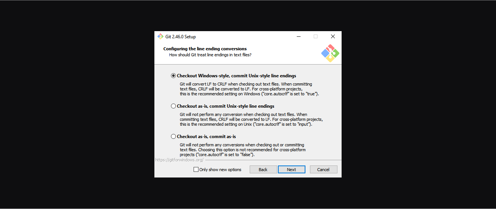
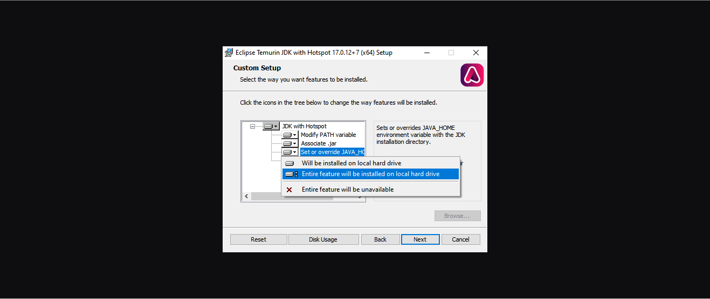
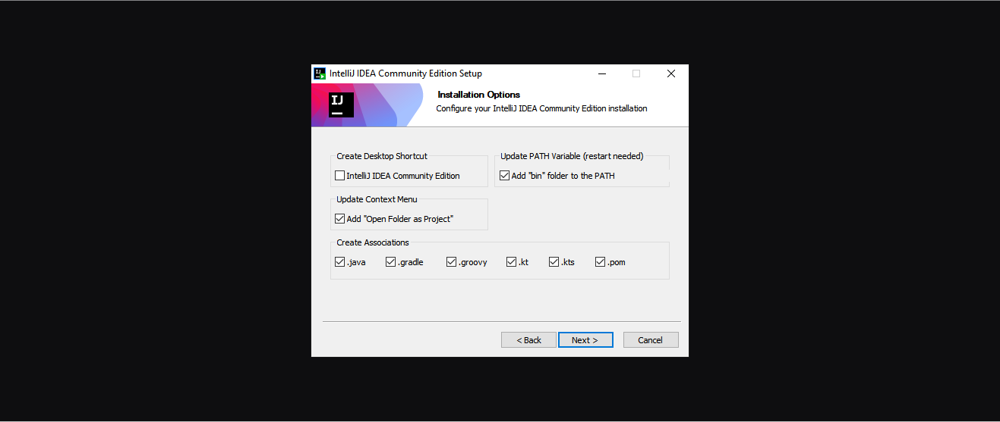
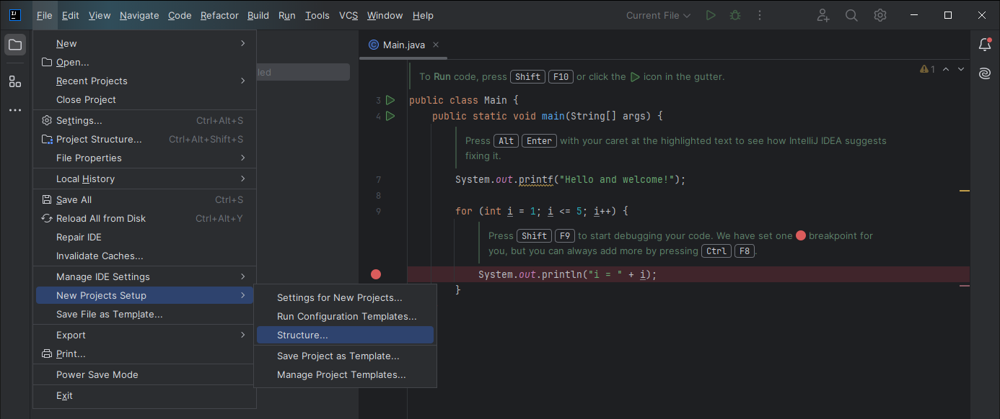
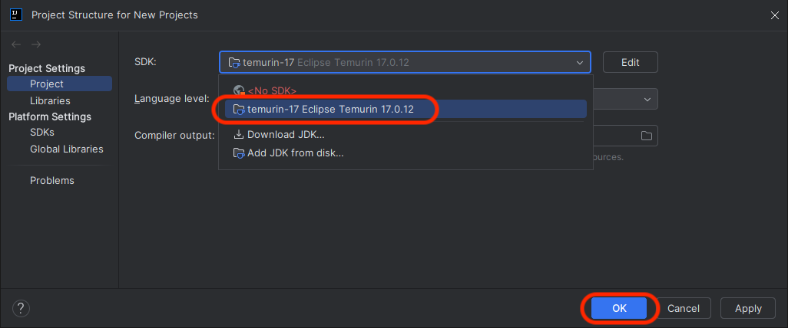

<h1>
  <span class="headline">Java Installfest</span>
  <span class="subhead">Windows</span>
</h1>

## What you need to begin *(you must read this, do not skip this, this is important)*

- ***A device running Windows 11 version 23H2 (OS Build 22631 or greater) or Windows 10 version 22H2 (OS Build 19045 or greater).***

  To find your Windows version and build number, use <kbd>⊞ Windows</kbd> + <kbd>R</kbd> on your keyboard, type **`winver`**, and select **OK**. You'll see a dialog window like the one below (it will look slightly different in Windows 10). Note the Version: 23H2.

  
- At least 10GB of free hard drive space.
- At least 8GB of RAM. 16GB of RAM or more is preferable and will improve your learning experience.
- A user account with administrative privilege to your local installation of Windows.
- A fundamental understanding of Windows system administration and debugging.

## What you'll install

By following this guide, you'll sign up for the following services:

- [GitHub Enterprise](#github-enterprise-ghe)

You'll install the following tools and software:

- [Git and Git Bash](#git)
- [GitHub CLI](#github-cli)
- [JDK 17](#jdk-17)
- [IntelliJ CE](#intellij-idea-community-edition)

## Troubleshooting

If you run into issues during Installfest, please reach out to your Installfest point of contact.

## A note on copying commands

When possible, ***please copy the commands from this page***. You will use most of the commands here once and never again. Typing them out will only introduce the possibility of you making errors. Certain commands will require you to alter portions of them - this is specifically called out when they appear. There are no bonus points for doing work already done for you.

### Copying text in code blocks

To copy text from code blocks, use your mouse to hover over the code block. A **Copy** button will appear in the upper right corner. Click this, and the text held in the code block will be put on your clipboard, ready to be pasted.


## GitHub Enterprise (GHE)

You'll use General Assembly's private GitHub Enterprise instance (commonly abbreviated as GHE) throughout the course. If you think of GitHub as a social media platform for developers worldwide, you can think of GitHub Enterprise as a social media platform just for developers at General Assembly.

You can sign up for an account here: **[http://git-invite.generalassemb.ly/]( http://git-invite.generalassemb.ly/)**

If you already have a GitHub account, you may use the same username for both GitHub & GHE accounts; however, we recommend that you distinguish between the two by appending **-ga** to your GitHub username, for example, **YourGitHubUsername-ga**.

## Git

Git is the version control software we will use in this course.

Download Git for Windows from [this download page](https://git-scm.com/downloads). Run the downloaded file.

***You will be given many prompts on features to install and choices to make while installing Git. All of these may be left as their default, except for the ones below.***

You should use a text editor you feel comfortable working in as Git's default editor. Visual Studio Code has been selected in this screenshot, but you can use any text editor you'd like.


We'll use the `main` branch as the default when creating new repos locally. This will align the default branch name in Git with the default branch name on GitHub.


The following options should already be selected as the default, but pay special attention to them as they are important:

On the **Adjusting your PATH environment** step, select the **Git from the command line and also from 3rd-party software** option. This allows you to interact with Git from 3rd party apps and CLIs other than Git Bash.


On the **Configuring the line ending conversions** step, Select the **Checkout Windows-style, commit Unix-style line endings** option. This ensures interoperability between code written on macOS/Linux and Windows.



### Git Bash config

When the installation is complete, launch the newly installed Git Bash app.

While optional, we can make one quality-of-life change to interact with Git Bash more easily. By default, the keyboard combination to copy and paste in the Git Bash app is <kbd>Ctrl</kbd> + <kbd>Ins</kbd> (Copy) and <kbd>Shift</kbd> + <kbd>Ins</kbd> (Paste). These keyboard combination is not intuitive to most people, and many keyboards do not have the <kbd>Ins</kbd> key. Luckily, we're able to change it.

> 🧠 Want to leave this setting as it is? Continue to the **Git config** section below.

With Git Bash open, right-click the app's title bar and select the **Options...** option.

In the **Options** window, select **Keys** from the left navigation, then check the **Ctrl+Shift+letter shortcuts** checkbox, and then save the change with the **Save** button.

With this setting on, you can now use <kbd>Ctrl</kbd> + <kbd>Shift</kbd> + <kbd>C</kbd> to copy text from Git Bash and <kbd>Ctrl</kbd> + <kbd>Shift</kbd> + <kbd>V</kbd> to paste text in Git Bash. While this is still an adjustment from the regular copy/paste action, it should feel somewhat familiar.

### Git config

With Git installed and the Git Bash app open, we can now make some configuration changes to make it a more effective tool. Complete all of the following configuration steps in Git Bash.

Use the below command to add a user name to Git, which will be used to identify your commits. Replace `User Name` with a name of your choice. Make sure you leave the quotes surrounding your username. Keep the name somewhat professional, or just use your name - this will be used to identify your commits on GitHub. There will not be any output from this command.

```bash
git config --global user.name "User Name"
```

Next, use the below command to add an email to Git, which will be used to identify your commits.

Replace `user@email.com` with the email address associated with your [`https://git.generalassemb.ly`](https://git.generalassemb.ly) account. Ensure you leave the quotes surrounding your email. There will not be any output from this command.

```bash
git config --global user.email "user@email.com"
```

Configure Git to track case changes in file names. There will not be any output from this command.

```bash
git config --global core.ignorecase false
```

## GitHub CLI

We'll use the GitHub command line utility to perform some actions on GitHub. Install it with this command in your terminal:

```bash
winget install --id GitHub.cli
```

Follow the prompts for any user agreements. You'll need to provide system administrator access as part of the installation.

Once it is installed, you'll use it to log in to your General Assembly GitHub Enterprise account from the command line. Use this command:

```bash
gh auth login
```

You'll encounter a series of prompts to complete your login. Follow these steps:

1. You will be prompted to log in to a GitHub.com account or a GitHub Enterprise account. Select the **GitHub Enterprise Server** option.
2. Use `git.generalassemb.ly` as the GHE hostname.
3. Choose **HTTPS** as the preferred protocol for Git operations.
4. When asked to authenticate Git with your GitHub credentials, press <kbd>Y</kbd> and then <kbd>↩ Enter</kbd>.
5. Select the **Login with a web browser** option when asked how you would like to authenticate.
6. Copy the one-time code from your terminal, then press the <kbd>↩ Enter</kbd> key to open `https://git.generalassemb.ly/login/device` in your browser.
7. Paste the code you copied from the terminal, and hit continue.
8. Authorize the GitHub CLI when asked.
9. You may be asked to confirm your GHE account password. Do so.
10. The CLI app should update automatically to confirm that you're logged in. It should look something like this:

    ```plaintext
    ✓ Authentication complete.
    - gh config set -h git.generalassemb.ly git_protocol https
    ✓ Configured git protocol
    ✓ Logged in as student
    ```

You should now be able to interact with General Assembly's GitHub Enterprise from the command line!

## JDK 17

We'll get JDK 17 LTS from Adoptium. This will allow you to run and compile Java applications on your device.

Download JDK 17 from [this page](https://adoptium.net/temurin/releases/?os=windows&version=17&arch=any&package=jdk). Download the `.msi` file, not the `.zip` file. 

Execute the downloaded file.

***You will be given many prompts on features to install and choices to make while installing JDK 17. All of these may be left as their default, except for the ones below.***

On the **Custom Setup** step, look for the **Set or override JAVA_HOME variable** option. Select the **X** next to the option, then select the **Entire feature will be installed on the local hard drive** option from the dropdown.



Additionally, you'll be asked to provide administrative access as part of the installation process. Ensure you allow it.

### Confirm the `JAVA_HOME` environment variable has been set

If the Git Bash application is open, close it, then re-open it.

<blockquote class="warning">
  🚨 Quit Git Bash completely before continuing.
</blockquote>

Start Git Bash and run this command:

```bash
echo $JAVA_HOME
```

You should see some output that looks similar to this:

```plaintext
C:\Program Files\Eclipse Adoptium\jdk-17.0.12.7-hotspot\
```

## IntelliJ IDEA Community Edition

We'll use IntelliJ IDEA Community Edition (CE) as our Java IDE. Download the Community Edition from [the download page](https://www.jetbrains.com/idea/download/?section=windows). Download the `.exe` version.

<blockquote class="warning">
  🚨 The IntelliJ IDEA Ultimate and IntelliJ IDEA Community Edition downloads are on the same page. Ensure you download the free Community Edition version, not the paid Ultimate version.
</blockquote>

Execute the downloaded file and follow the steps to install it. You'll be prompted to provide administrative access on your device to continue. Do so.

***You will be given many prompts on features to install and choices to make while installing IntelliJ IDEA CE. All of these may be left as their default, except for the ones below.***

On the **Installation Options** step, select the following options:

- In the **Update PATH Variable (restart needed)** section, ensure the **Add "bin" folder to the PATH** setting is enabled.
- In the **Update Context Menu** section, ensure the **Add "Open Folder as Project"** setting is enabled.
- In the **Create Associations** section, ensure every item is enabled.

When complete, this should look similar to the below screenshot:



You'll be prompted to reboot your device to complete the setup at the end of the installation process. Save this page, then reboot your device.

### IntelliJ IDEA CE configuration

Open the **IntelliJ IDEA CE** application now.

Follow the prompts in the user agreement terms and the data sharing dialogs. If you are asked if you'd like to import your settings from another IDE, skip that step.

Finally, you'll arrive at a page titled **Welcome to IntelliJ IDEA**. Start a new project with the default settings now - you can delete it later; we just need access to the default settings for new projects.

### Set the default project SDK

With a new project open, select the ☰ menu in the upper left corner of the project window, which will reveal the **File** option. Find the **New Projects Setup** option and then choose **Structure...**. This is shown in the screenshot below.



A dialog box will appear where you can change the default settings for new projects. Change the SDK to the **temurin-17** option. The full option may appear slightly different than the option outlined in red in the screenshot below. That's okay.

After you've selected the default SDK, select the **OK** button outlined in red below.



## You did it!

Great work completing Installfest! 🎉
